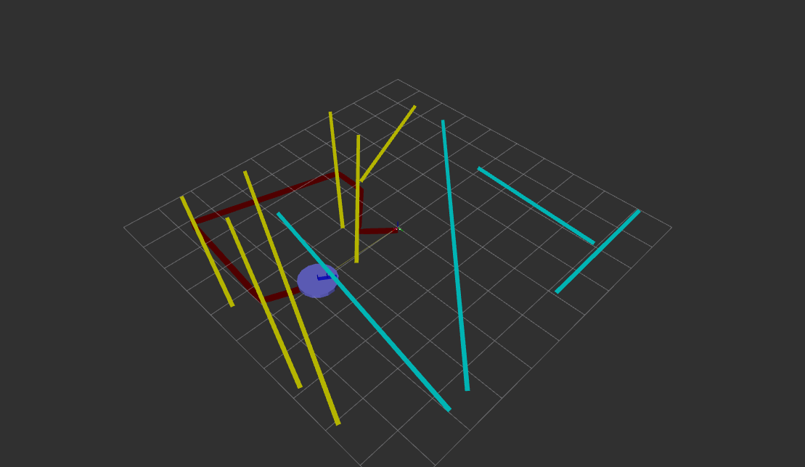

# 🤖 Heuristic and Local-Optimization-Based Controller for Efficient Segment Visitation

**Short Description:**  
Combines heuristic nearest-neighbor planning with local 2-opt optimization for path refinement.

-# Heuristic and Local-Optimization-Based Controller for Efficient Segment Visitation

## 🔹 Overview

This controller is designed for a **simulated robot in ROS 2** that must traverse multiple target line segments.
It integrates **heuristic planning** with **local optimization** to efficiently plan and execute the robot's path.
The controller uses **ROS 2 topics** for robot pose (`/pose`), unvisited segments (`/unvisited_targets`), and publishes velocity commands (`/cmd_vel`).

A **screenshot** of the robot in RViz visualizing the path is included below.

---

## 🔹 Full Logic and Workflow

### **1. Target Acquisition**

* Subscribe to `/unvisited_targets` to receive all segment endpoints.
* Consecutive points are paired to form line segments.
* Segments are stored as a list: `[[(x1,y1),(x2,y2)], [(x3,y3),(x4,y4)], ...]`

### **2. Heuristic Planning (Nearest-Neighbor)**

* Robot starts at current pose `(x_r, y_r)`.
* Iteratively selects the nearest unvisited segment endpoint using **Euclidean distance**:
  [
  d = \sqrt{(x_r - x_s)^2 + (y_r - y_s)^2}
  ]
* Produces a **fast initial visiting order** for all segments.
* This step ensures the robot does not make long unnecessary detours.

### **3. Local Optimization (2-Opt Algorithm)**

* The initial path from nearest-neighbor is refined using **2-opt swaps**.
* For segments `i` and `j`, a swap is applied if it reduces total path distance:
  [
  D_\text{total,new} = \sum_{k} d_{k,k+1} < D_\text{total,old}
  ]
* This reduces overall traversal distance and minimizes backtracking.

### **4. Segment Crossing and Execution**

* For each segment, the **optimal crossing point** `P` is selected to minimize a combined cost of heading change and distance:
  [
  \text{Cost}(P) = W_\text{turn} \cdot \Delta \theta + W_\text{dist} \cdot d
  ]
  Where:

* `Δθ` = heading change required to reach `P`

* `d` = distance from current robot position

* `W_turn`, `W_dist` = configurable weights for rotation vs distance

* **Motion Control**:

  * Linear velocity: `v = K_linear * d_target`
  * Angular velocity: `ω = K_angular * Δθ`
  * Smooth control ensures minimal oscillation while moving toward `P`

* **Segment Completion**: segment is marked visited when robot is within a distance threshold and heading alignment is achieved.

### **5. Path Execution Summary**

1. Acquire all targets from simulator.
2. Form segments by pairing consecutive endpoints.
3. Plan initial path using nearest-neighbor heuristic.
4. Refine path with 2-opt optimization.
5. For each segment, select optimal crossing point minimizing heading change + distance.
6. Command robot to move using smooth proportional velocity control.
7. Mark segment as visited and continue until all segments are completed.

### **6. Visualization in RViz**

* Robot model shows current pose.
* Markers show all segments, highlighting visited vs unvisited.
* Path trace shows trajectory.

### **7. Key Equations**

* **Distance to segment endpoint**:
  [ d = \sqrt{(x_r - x_s)^2 + (y_r - y_s)^2} ]

* **Segment crossing cost**:
  [ \text{Cost}(P) = W_\text{turn}
